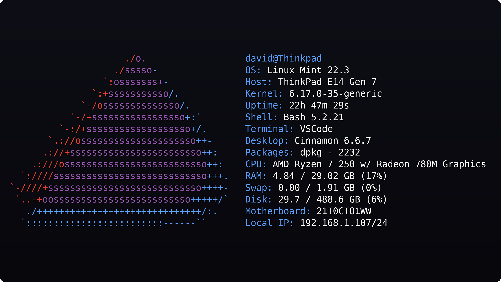
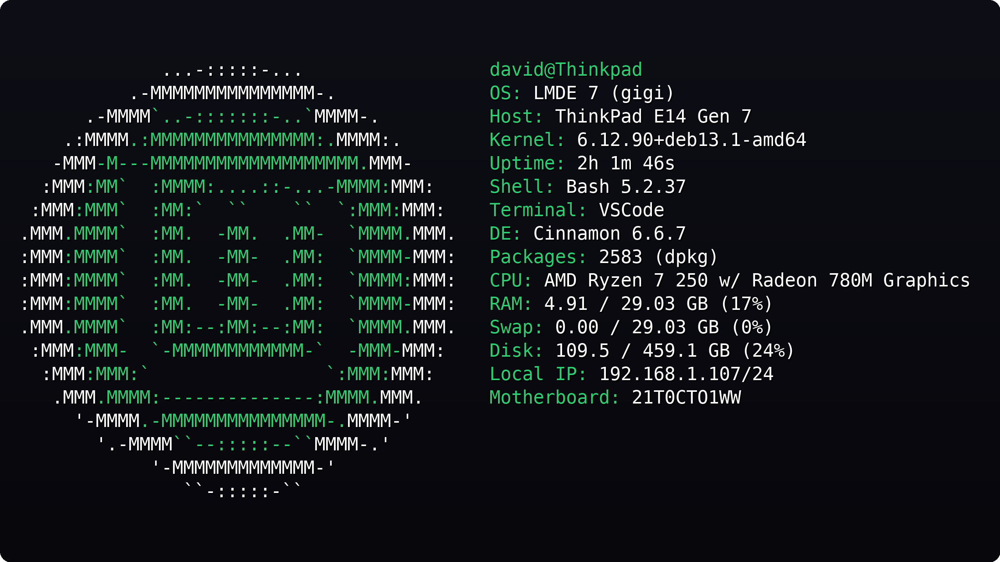
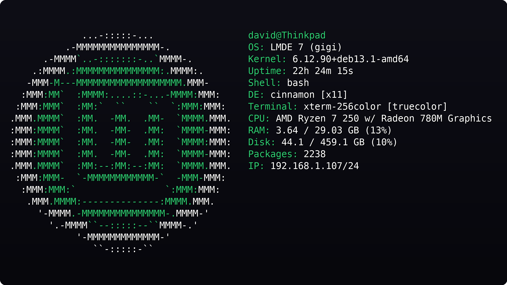
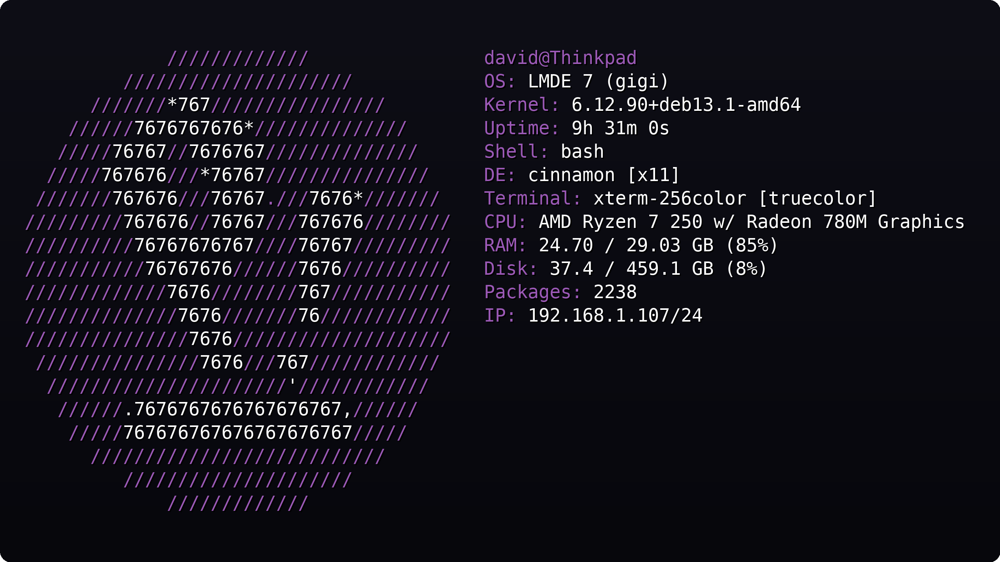

# Dfetch

Dfetch is a lightweight system information tool focused on clean output, fast startup times, and simple configuration. It provides useful system details without the complexity of heavily customizable alternatives.

<table>
  <tr>
    <td></td>
    <td></td>
  </tr>
  <tr>
    <td></td>
    <td></td>
  </tr>
</table>

## Why use this?

Dfetch is designed for those who want a simple system information tool with sensible defaults, clean output, and fast startup times. Rather than prioritizing extensive customization, Dfetch focuses on providing useful information in a readable format with minimal startup overhead.

## Features

- Fast startup time
- Simple configuration file
- Useful, clutter-free system information
- Custom ASCII art support
- Configurable modules
- No external dependencies
- Clean default look

## Installation

To install Dfetch, visit [the releases page](https://github.com/David17c/Dfetch/releases) and either download the package for your operating system, download a prebuilt binary, or build Dfetch from source.

### For NixOS

For detailed NixOS installation and configuration instructions, see [NIXOS.md](NIXOS.md).

## Customization

`~/.config/Dfetch/Dfetch.conf`

```
// Lines starting with `//` are comments and are ignored by Dfetch.
// In the modules section, you can change which information is displayed and in what order.

// Insert empty lines in the modules block to get empty lines in the final output.
modules {
    userinfo
    os
    host
    kernel
    uptime
    shell
    terminal
    desktop
    packages
    cpu
    memory
    swap
    disk
    motherboard
    local_ip
    // battery
    // time
    // date
}

custom_ascii: default
// Set a custom ASCII logo by providing the path to the text file containing it.

label_color: default
// Color of the information labels.

userinfo_color: default
// Color of the userinfo module.

info_color: default
// Color of the system info.

// Available colors:
// black, red, green, yellow, blue,
// magenta, cyan, white,
// bright_black, bright_red,
// bright_green, bright_yellow,
// bright_blue, bright_magenta,
// bright_cyan, bright_white
```

## Supported Linux distributions

| Distribution | Status |
|--------------|--------|
| Arch | Tested |
| Artix | Untested |
| Bazzite | Tested |
| CachyOS | Tested |
| Debian | Tested |
| EndeavourOS | Tested |
| Fedora | Tested |
| Linux Mint | Tested |
| Manjaro | Tested |
| NixOS | Tested |
| OpenSUSE Leap | Tested |
| OpenSUSE Tumbleweed | Tested |
| Pop!_OS | Tested |
| Ubuntu | Tested |
| Zorin OS | Tested |

If your favorite distribution isn't listed, it may still be supported. This table only includes distributions that have built-in ASCII art.

Most listed distributions have been tested, but bugs may still exist. Since Dfetch is not continuously tested on every supported distribution, some issues may go unnoticed.

## Custom ASCII art

Save your custom ASCII art in a text file. It should look something like this.

```
             ...-:::::-...
         .-MMMMMMMMMMMMMMMMM-.
      .-MMMM`.-=:::::::=-.`MMMM-.
    .:MMMM.:MMMMMMMMMMMMMMM:.MMMM:.
   -MMM-M---MMMMMMMMMMMMMMMMMMM.MMM-
  :MMM:MM`  :MMMM:....::-...-MMMM:MMM:
 :MMM:MMM`  :MM:`  ``    ``  `:MMM:MMM:
.MMM.MMMM`  :MM.  -MM.  .MM-  `MMMM.MMM.
:MMM:MMMM`  :MM.  -MM-  .MM:  `MMMM-MMM:
:MMM:MMMM`  :MM.  -MM-  .MM:  `MMMM:MMM:
:MMM:MMMM`  :MM.  -MM-  .MM:  `MMMM-MMM:
.MMM.MMMM`  :MM:--:MM:--:MM:  `MMMM.MMM.
 :MMM:MMM-  `-MMMMMMMMMMMM-`  -MMM-MMM:
  :MMM:MMM:`                `:MMM:MMM:
   .MMM.MMMM:--------------:MMMM.MMM.
     '-MMMM.-MMMMMMMMMMMMMMM-.MMMM-'
       '.-MMMM``--:::::--``MMMM-.'
           '-MMMMMMMMMMMMMMM-'
               ``-:::::-``
```

You can then optionally add colors by using color tags. For a list of supported colors look at the default config file.

```
             ${bright_white}...-:::::-...
${bright_white}        .-MMMMMMMMMMMMMMMMM-.
${bright_white}     .-MMMM${green}`.-=:::::::=-.`${bright_white}MMMM-.
${bright_white}   .:MMMM${green}.:MMMMMMMMMMMMMMM:.${bright_white}MMMM:.
${bright_white}  -MMM${green}-M---MMMMMMMMMMMMMMMMMMM.${bright_white}MMM-
${bright_white} :MMM${green}:MM`  :MMMM:....::-...-MMMM:${bright_white}MMM:
${bright_white}:MMM${green}:MMM`  :MM:`  ``    ``  `:MMM:${bright_white}MMM:
${bright_white}.MMM${green}.MMMM`  :MM.  -MM.  .MM-  `MMMM.${bright_white}MMM.
${bright_white}:MMM${green}:MMMM`  :MM.  -MM-  .MM:  `MMMM-${bright_white}MMM:
${bright_white}:MMM${green}:MMMM`  :MM.  -MM-  .MM:  `MMMM:${bright_white}MMM:
${bright_white}:MMM${green}:MMMM`  :MM.  -MM-  .MM:  `MMMM-${bright_white}MMM:
${bright_white}.MMM${green}.MMMM`  :MM:--:MM:--:MM:  `MMMM.${bright_white}MMM.
${bright_white} :MMM${green}:MMM-  `-MMMMMMMMMMMM-`  -MMM-${bright_white}MMM:
${bright_white}  :MMM${green}:MMM:`                `:MMM:${bright_white}MMM:
${bright_white}   .MMM${green}.MMMM:--------------:MMMM.${bright_white}MMM.
${bright_white}     '-MMMM${green}.-MMMMMMMMMMMMMMM-.${bright_white}MMMM-'
${bright_white}       '.-MMMM${green}``--:::::--``${bright_white}MMMM-.'
${bright_white}           '-MMMMMMMMMMMMMMM-'
${bright_white}               ``-:::::-``

label_color: green
userinfo_color: green
info_color: default
```

At the bottom of the ASCII art file, you can optionally specify the same color settings available in the configuration file. Color settings in the custom ASCII file override those in the configuration file.

In your config file, set: `custom_ascii: PATH_TO_FILE`. Dfetch should now be using your ASCII art.
