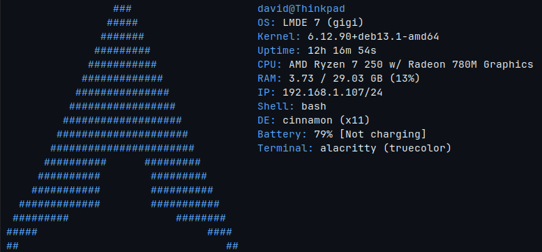

# Dfetch

A clean and practical system information tool focused on clean, easy to understand output and fast startup times. It is designed to provide useful system information while being lightweight enough to launch instantly with your terminal.



## Why use this?

Dfetch does not try to compete with heavily customizable alternatives like [Neofetch](https://github.com/dylanaraps/neofetch) or [Fastfetch](https://github.com/fastfetch-cli/fastfetch). The project exists mainly as a fun project for myself, while still being useful for those who prefer clean, easy to configure tools with good defaults.

## Installation

Currently no official package for any platform is provided. You can either build Dfetch from source or [download the latest prebuilt binaries](https://github.com/David17c/Dfetch/releases).

## Customization

`~/.config/Dfetch/Dfetch.conf`

```
// Lines starting with `//` are comments and are ignored by Dfetch.
// In the System Information section you can change what info is displayed and in what order.

//------------------------
// Colors

asciicolor: default
accentcolor: default

// Available colors:
// black, red, green, yellow, blue,
// magenta, cyan, white,
// bright_black, bright_red,
// bright_green, bright_yellow,
// bright_blue, bright_magenta,
// bright_cyan, bright_white

// ------------------------
// System info modules

os
kernel
uptime
cpu
memory
localip
shell
de
// battery
terminal

// ------------------------
// Options

asciisize: default
// Ascii size can be either 'big', 'default' or 'small'. Default is big.

customascii: default
// Set your own custom ascii logo by providing a path to it.
```

## Supported distros

```txt
- Arch
- CachyOS
- Debian
- Fedora
- Linux Mint
- OpenSUSE Leap
- OpenSUSE Tumbleweed
- Pop! OS
- Ubuntu
```
