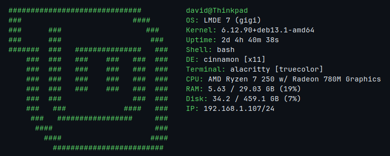
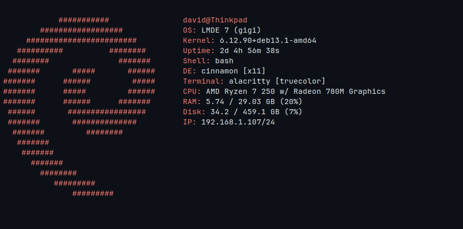
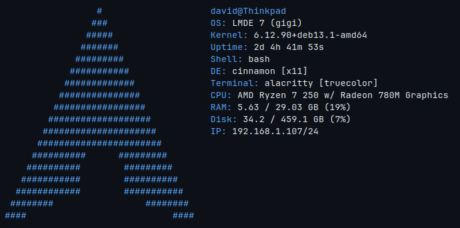
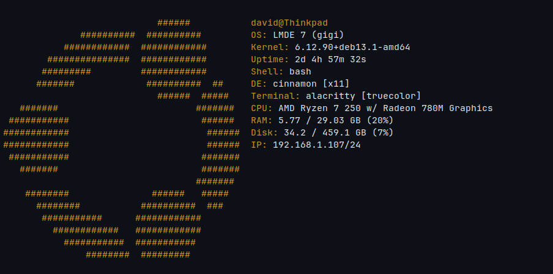

# Dfetch

A clean and practical system information tool focused on clean, easy to understand output and fast startup times. It is designed to provide useful system information while being lightweight enough to launch instantly with your terminal.

<table>
  <tr>
    <td></td>
    <td></td>
  </tr>
  <tr>
    <td></td>
    <td></td>
  </tr>
</table>

## Why use this?

Dfetch does not try to compete with heavily customizable alternatives like [Neofetch](https://github.com/dylanaraps/neofetch) or [Fastfetch](https://github.com/fastfetch-cli/fastfetch). The project exists mainly as a fun project for myself, while still being useful for those who prefer clean, easy to configure tools with good defaults.


## Installation

Currently no official package for any platform is provided. You can either build Dfetch from source or [download the latest prebuilt binaries](https://github.com/David17c/Dfetch/releases).

## Customization

`~/.config/Dfetch/Dfetch.conf`

```
// Lines starting with `//` are comments and are ignored by Dfetch.
// In the modules section you can change what info is displayed and in what order.

// 'Emptyline' module can be used to get an empty line in between modules
modules {
	userinfo
	os
	kernel
	uptime
	shell
	de
	terminal
	cpu
	memory
	disk
	// battery
	localip
	// time
	// date
}

asciisize: default
// Ascii size can be either 'big', 'default' or 'small'. Default is big.

customascii: default
// Set a custom ascii logo by providing a path to the txt file containing it.

asciicolor: default
// Color of ascii art

accentcolor: default
// Color used by the info labels

// Available colors:
// black, red, green, yellow, blue,
// magenta, cyan, white,
// bright_black, bright_red,
// bright_green, bright_yellow,
// bright_blue, bright_magenta,
// bright_cyan, bright_white
```

## Supported Linux distros

```txt
- Arch
- CachyOS
- Debian
- Fedora
- Linux Mint
- OpenSUSE Leap
- OpenSUSE Tumbleweed
- Pop! OS
- Ubuntu
```
