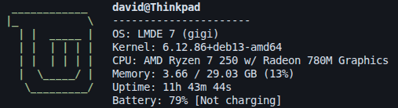

# Dfetch

Command-line tool inspired by [Neofetch](https://github.com/dylanaraps/neofetch) and written in Go. Dfetch shows information relating to your OS, hardware, and software in a visually pleasing way.



Dfetch has a focus on being minimal and visually appealing while also being fast and easy to configure.

## Installation

You can install Dfetch by going to the [releases page](https://github.com/David17c/Dfetch/releases) on GitHub and installing the right version for your distro.

If there is no release that works on your distro, you're going to have to compile Dfetch yourself.

### Step 1

Go to the main GitHub page for this repo and click the green Code button. When a dropdown menu appears, click "Download ZIP".

### Step 2

Unzip the file you just downloaded and navigate to it in the terminal using the `cd` command.

```bash
cd ~/Downloads/Dfetch
```

### Step 3

Install the [Go](https://go.dev/) programming language. This step is different depending on your distro.

Debian / Ubuntu:

```bash
sudo apt install golang-go
```

Arch:

```bash
sudo pacman -S go
```

Fedora:

```bash
sudo dnf install golang
```

You can verify it's installed by running:

```bash
go version
```

### Step 4

Now that you have Go installed and have navigated to the root of the project folder, you're nearly done.

Run:

```bash
go build -ldflags="-s -w" -trimpath -o build/Dfetch
```

To compile the program and store the executable file in the `Dfetch/build` folder.

You can now execute the file you just created and use the program.

## Usage

Run Dfetch using:

```bash
dfetch
```

Or, if you compiled it from source:

```bash
./build/Dfetch
```

## Customization

When you first run Dfetch it creates a config file in `~/.config/Dfetch/Dfetch.conf`. In this file you will find a few things.

* Lines starting with `//` are comments and are ignored by Dfetch.

* Commented out by default, `color:` allows you to change the color of the ASCII art to any of the colors listed below.

* At the end of the file you will find a list labeled `// Info to fetch`. Here you can remove and add to the information that will be displayed when you run the program. You can also change the order in which those items appear.

Instead of just removing items, I'd recommend commenting them out to more easily get them back later.

If you ever want to return to the default settings, just remove the config file and run the program to generate a new one.

```txt
Supported colors:

- Black
- Red
- Green
- Yellow
- Blue
- Magenta
- Cyan
- White

- Bright_black / gray / grey
- Bright_red
- Bright_green
- Bright_yellow
- Bright_blue
- Bright_magenta
- Bright_cyan
- Bright_white
```

## Supported distros

The following is a list of supported distros. Dfetch definitely works on many more distros, however these distros have been tested and have their own ASCII art. More distros will be added in the future.

```txt
- Debian
- Arch
- Fedora
- Ubuntu
- Linux Mint
```

## Command-line options

The following is a list of available command-line options.
```
--no-color          # Removes all color from output
```

## File structure

```txt
Dfetch
├── customization
│   ├── configfile.go    # Handles config file operations
│   └── colors.go        # Supported colors
│
├── getsysinfo
│   ├── cpu.go           # CPU information
│   ├── distro.go        # Linux distribution
│   ├── hostname.go      # System hostname
│   ├── kernel.go        # Kernel version
│   ├── localip.go       # Local IP address
│   ├── memory.go        # Memory usage
│   ├── uptime.go        # System uptime
│   ├── battery.go       # Battery percentage and status
│   ├── username.go      # Current username
│   └── de.go            # Current Desktop environment
│
├── go.mod               # Go module config
├── LICENSE              # Project license
│
├── logo                 # ASCII logos
│   ├── arch.txt
│   ├── debian.txt
│   ├── linuxmint.txt
│   ├── ubuntu.txt
│   ├── fedora.txt
│   └── ...
│
├── main.go              # Start / end of program
└── README.md            # Project overview
```

> Note: AI tools were used for small changes and file organization, but the project’s code was written by humans.
